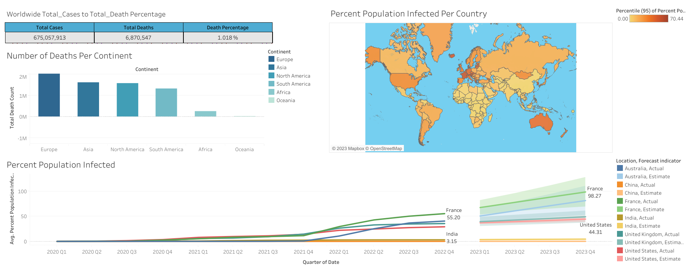

# My Data Science Portfolio

This repository contains Data Analysis and Data Science projects completed by me for self learning and career progression purpose. The main source of my learning is "Full Stack Data Science Program" from AlmaBetter and self study via internet and youtube videos. Presented in the form of Jupyter Notebook.

_Note: Data used in the projects is for demonstration purposes only._

## Instructions for Running Python Notebooks usingh Google Colab Notebook
1. Download the .ipynb and data files.
2. Store the .ipynb and data file in your Google Drive
3. Open Google Colab from https://colab.research.google.com/
4. Select the .ipynb file from Google Drive
5. Mount your Drive in Google Colab Notebook 
6. Change the file location to your Google Drive Location of file.

## Contents

- ### Data Analysis
	- __Exploratory Data Analysis on Python__
		- [EDA on Titanic Dataset](https://github.com/Ankur241289/EDA_on_Titanic_Dataset/blob/master/EDA%20Titanic%20Dataset%20.ipynb): Exploratory Data Analysis of the data for passengers onboard during the fatal Titanic crash using Pandas and Seaborn visualisations.
    
      - [Capstone Project-EDA on Play Store App Review Analysis](https://github.com/Ankur241289/Capstone-Project---EDA-on-Play-Store-App-Review-Analysis/blob/master/Ankur_Singh_EDA_Play_Store_App_Review_Analysis.ipynb) : Exploratory Data Analysis on Play Store App Review Analysis. This project was done by me as a requirement of Module-1 Python for Data Science for "Full Stack Data Science" Program of AlmaBetter.
    		
	  _Tools: Pandas, Seaborn and Matplotlib_
 
  - __Data Analysis on SQL__
    - [Covid -19 Data Analysis using SQL Queries](https://github.com/Ankur241289/Data_Science_Portfolio/blob/master/SQL%20Data%20Exploration%20Covid-19%20Data/Covid%20Data%20Exploration%20Portfolio%20Project%2004-03-2023.sql): Portfolio project done by me to explore Covid-19 data using SQL-Queries.
  
    _Tools: Microsoft SQL & Microsoft Excel_
  
- ### Data Visualization
  - __Data Visualization on Tableau__
    - [Google Fiber Repeat Call Analysis](https://public.tableau.com/app/profile/ankur.singh1463/viz/GoogleFiberRepeatCallsAnalysisGoogleBIProfessionalProject/Dashboard1): This project contains 5 Reports and 3 Dashboards. This dashboard was part of Google Business Intelligence Certificate, where I had to make reports and dashboards to provide insights on Repeat Calls Analysis for Google Fiber Department.
    
    
    _Tools: Tableau Public & Google Big Query for preparing data_
    
    - [Athens Airbnb Data Vislualization](https://public.tableau.com/app/profile/ankur.singh1463/viz/AthensAirbnbDataforGoogleBIProfessionalCertificate/AthensAirbnbDashGoogleBIProfessionalCertificate): This dashboard was created by me to visualilze details of:
      1. Average Neighborhood Price in Athens.
      2. Rooms type with Average Price
      3. Popular areas (Visualization on Map)
     .png)

    - [Covid -19 Trend Analysis Dashboard](https://public.tableau.com/app/profile/ankur.singh1463/viz/Covid-19BasicDashboard_16795111037710/Dashboard1?publish=yes): Data Visualization Portfolio project done by me to visualize basic Covid-19 data via Dashboard using Tableau Public.
     
  
    _Tools: Tableau Public & Microsoft Excel_
  
I am currently working on my Data Science Portfolio, the above mentioned projects are only the beginning of my Data Science journey. More projects will be uploaded regularly. If you want to have a chat with me about the portfolio, work opportunities, or collaboration, shoot an email at ankursingh@outlook.com. 

If you like what you see in this portfolio and have any suggestions for me then you are most welcome. As I am in the learning phase of Data Science, I would love to hear your thoughts and suggestions as how to improve my portfolio which could help me enter the Data Science field.....  Gracias amigos....❤️
